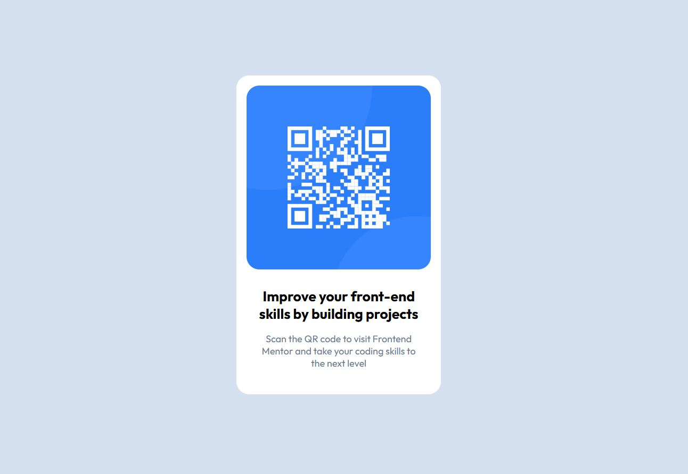

# Frontend Mentor - QR code component solution

This is a solution to the [QR code component challenge on Frontend Mentor](https://www.frontendmentor.io/challenges/qr-code-component-iux_sIO_H). Frontend Mentor challenges help you improve your coding skills by building realistic projects.

## Table of contents

- [Overview](#overview)
  - [Screenshot](#screenshot)
  - [Links](#links)
- [My process](#my-process)
  - [Built with](#built-with)
  - [What I learned](#what-i-learned)
  - [Continued development](#continued-development)
- [Author](#author)

## Overview

### Screenshot

### Links

- Solution URL: [Simple QR Code](https://github.com/carlosmarte23/simple-qr-component)
- Live Site URL: [Simple QR Code](https://carlosmarte23.github.io/simple-qr-component/)

## My process

### Built with

- Semantic HTML5 markup
- CSS custom properties
- Flexbox

### What I learned

I got more used to translate a design from figma to actual code, specially the styles using plain CSS. Even if probably it wasnt needed, I started practicing setting custom variables in CSS.

### Continued development

Id like to keep practicing more flexbox and maybe translating this to the grid layout, I tried to do it but still not fell confortable using it and didnt get the result that I wanted.

## Author

- Website - [Carlos Marte](https://www.frontendmentor.io/profile/carlosmarte23
- Twitter - [@carlosf04](https://www.x.com/carlosf04)
